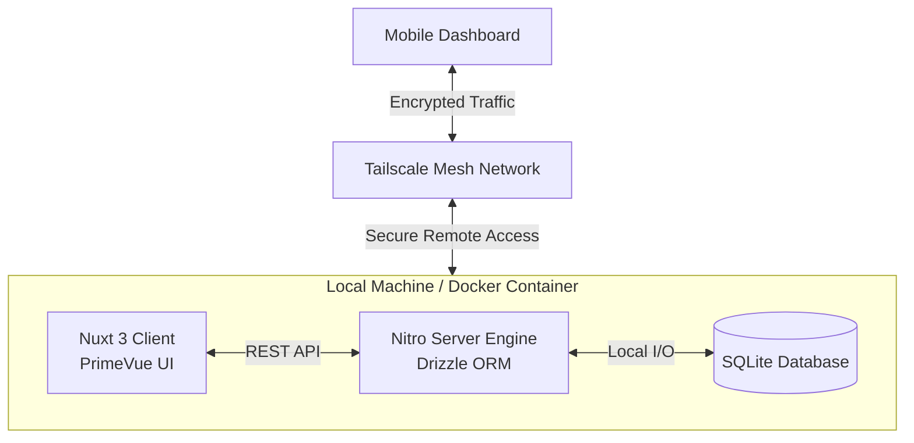
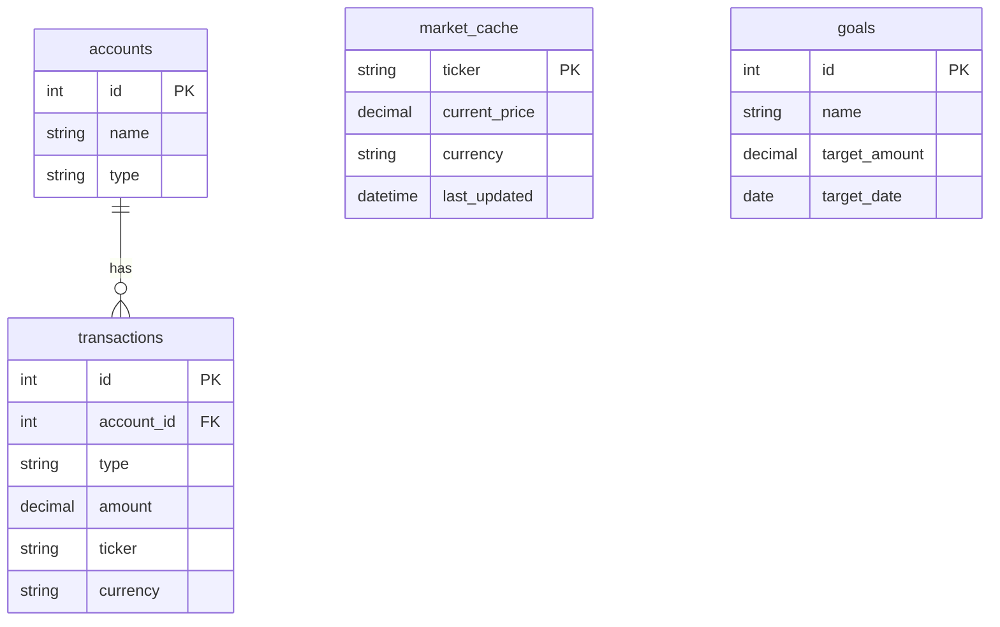

# 🏛️ Iron Vault
## 📊 A Smarter Personal Expense & Investment Visualizer

A privacy-first, zero-cost personal wealth operating system combining active budgeting with investment portfolio tracking. Built as a self-hosted monolithic application to ensure financial data never leaves local physical hardware.

## 🎯 Core Constraints & Architecture
* **Frontend:** Vue 3, Nuxt 3 (SSR + Hybrid Client Hydration), PrimeVue (Unstyled Mode + Custom Styling Tokens)
* **State Management:** Pinia (Modular Flat Stores)
* **Database & ORM:** SQLite (`better-sqlite3` driver) with Drizzle ORM
* **Hosting Environment:** Local Docker Container with persistent host volume mappings
* **Networking & Access:** Encrypted peer-to-peer mesh network via Tailscale (No public port forwarding required)

---

## 🏗️ System Architecture & Data Flow

### Server Cache Flow Strategy
To protect free third-party API limit boundaries (e.g., Alpha Vantage 25-request-per-day limit), all market data transactions must flow through a defensive server-side cache layout:
1. Client makes a request for a stock quote or net worth calculation.
2. Nitro server intercepts the request and inspects the local SQLite `market_cache` table.
3. If the cache record exists and `last_updated_at` is less than 60 minutes old, the data is served instantly from disk.
4. If the cache record is stale or missing, Nitro executes an outbound proxy fetch to the upstream API, upserts the new values to SQLite, and returns the fresh payload.

---

## 🗃️ Normalized Database Schema

## 📋 Comprehensive Scope of Work

### Phase 1: Infrastructure & Runtime Dockerization
*   Initialize Nuxt 3 project and configure core directory scaffolding.
*   Establish a local multi-stage production `Dockerfile` and `docker-compose.yml`.
*   Configure a persistent host filesystem mount pointing to `/app/data` to preserve the SQLite database file across container builds.

### Phase 2: Tailscale Mesh & Network Provisioning
*   Provision Tailscale across the development hardware node.
*   Bind the internal Docker runtime network listener environment flags (`HOST=0.0.0.0`, `PORT=3000`).
*   Verify cross-device secure connectivity by serving the default application shell directly to a mobile device over cellular data utilizing the private machine Tailnet IP.

### Phase 3: Database Design & Migration Strategy
*   Install Drizzle ORM and `better-sqlite3` dependencies.
*   Author the complete relational structural footprint inside `server/database/schema.ts`.
*   Generate localized physical migration assets (`drizzle-kit generate`) and execute database mutations locally against the development target sqlite binary.

### Phase 4: Nitro Cache Pipeline Backend Engine
*   Build the dynamic server API handler endpoints under `/server/api/`.
*   Write proxy service abstraction layers to safely consume external ticker data.
*   Implement transactional batch querying to prevent SQLite file write locks when pulling multi-ticker metrics simultaneously.

### Phase 5: Client-Side Ledger & CSV Ingestion
*   Install and configure PrimeVue within the Nuxt runtime interface layer.
*   Integrate a modular client-side CSV scanning mechanism utilizing `papaparse`.
*   Build an interactive file schema wizard mapping bank-specific statement logs to database rows with integrated duplication protection blocks.

### Phase 6: Financial Math Analytics & Reactive Views
*   Create an automated Nitro background task module to handle compounding historical interest calculations on interest-bearing cash accounts.
*   Build a unified Pinia store executing multi-lot weighted average cost basis evaluations using the mathematical standard: `Average Cost = Total Capital Invested / Total Shares Owned`.
*   Inject an real-time asset conversion pipeline normalizing cross-border holdings (USD-denominated assets mapped to CAD portfolio representations) utilizing a cached FX spot multiplier ticker.

---

## 🔍 Structural Security & Technical Gaps Addressed

### 1. Currency Isolation
Equities bought on US markets (USD) and Canadian savings assets (CAD) cannot be summed flatly. The system implements a mandatory baseline currency system. Non-native assets undergo automated frontend mathematical scaling based on a localized, cached currency exchange tracking ticker before being compiled into cumulative dashboard net worth components.

### 2. Isolation of Financial Transfers
Moving capital from a checking account to an investment holding can erroneously skew historical budgeting statistics. The ledger isolates capital relocation steps through an explicit `TRANSFER` tag layer. This effectively decouples investment financing movements from everyday category outflow data (e.g., food, utilities).

### 3. Precision Financial Aggregations
Standard database floating-point values introduce systemic rounding inaccuracies across extended calculation strings. To prevent data rounding mutations across fractional equity assets or interest compounding ticks, fractional investment shares and monetary values are scaled or strictly typed as real/decimal types with explicitly defined floating point boundaries.
