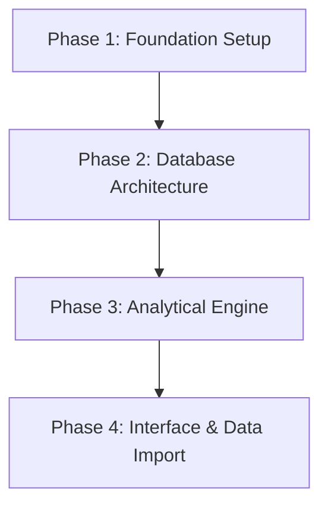

# Statement of Work: Iron Vault

## 1. Executive Summary & Vision
**Iron Vault** is a private, secure digital vault designed to give you total control over your personal finances. Unlike mainstream apps (like Mint or Monarch) that require you to upload your sensitive bank data, passwords, and net worth details to corporate cloud servers, Iron Vault operates on a **"local-first"** philosophy. 

Every dollar tracked, investment logged, and transaction recorded stays entirely inside your own home on your physical equipment. It combines the deep analytics of a commercial investment platform with the absolute privacy of an offline spreadsheet, accessible securely from your phone anywhere in the world.

---

## 2. Core Business Value
* **Absolute Privacy:** Your financial history cannot be leaked, scanned by advertisers, or sold, because it never leaves your physical custody.
* **Zero Ongoing Costs:** By utilizing your existing hardware and smart open-source tools, this system costs $0 per month to maintain, permanently avoiding software subscription fees.
* **Automated Intelligence:** It replaces error-prone manual spreadsheets with automated portfolio calculations, currency conversions, and visual tracking charts.

---

## 3. Product Features & Capabilities

### 📈 Comprehensive Net Worth Tracking
A unified dashboard that aggregates all of your cash accounts, savings goals, and investment portfolios into one clear, real-time number.

### 🧮 Smart Portfolio Calculations
If you buy shares of the same stock at different prices over time, Iron Vault automatically calculates your true **Average Cost Basis** and accurate investment returns, doing all the complex background math for you.

### 💱 Dynamic Currency Handling
If you hold a mix of Canadian (CAD) and American (USD) investments, the system automatically fetches live exchange rates and converts everything cleanly into your home currency so your charts are always accurate.

### 🛡️ Secure Mobile Access
You can securely check your financial dashboard on your phone while away from home. This is achieved using a specialized private network tunnel (a secure digital pipeline) that connects your phone directly to your home computer, completely hidden from the rest of the public internet.

---

## 4. Scope of Work & Project Timeline

## 5. Definition of Done

- A secure login screen is accessible on both a desktop computer and a mobile device.
- An investment transaction can be added in either USD or CAD and correctly update the total portfolio valuation.
- Market data successfully updates automatically once per hour.
- All financial numbers can survive a computer reboot or power outage without data loss.